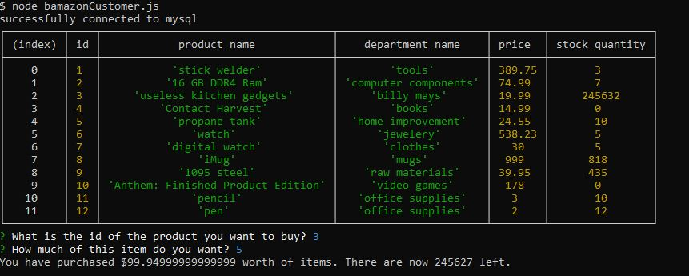
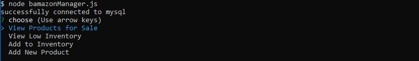

# Bamazon
This is a backend application made in node.js used in the terminal. It is an online retail app where Users can view and purchase items in the inventory, and the manager can view, restock, and remove items from said inventory.

To use this app, simply go to the repository from the terminal and type // node bamazonCustomer // to view and buy items. Then type the id of the item you wish to buy, and how much, and it will show you the total price and how much of that item is left in stock.
;

Alternatively, you can type // node bamazonManager // to manage the items. It will prompt you with four options you can navigate with arrows.
;

If you hit enter on "View Products for Sale", it will display the entire inventory.
If you choose "View Low Inventory", it will display witch items are in low stock.
If you choose "Add to inventory", it will ask for the id of the item you wish to restock and by what quantity.
If you choose "Add New Product", it will prompt you for the name of the item, it's department, it's sale price, and it's quantity.
